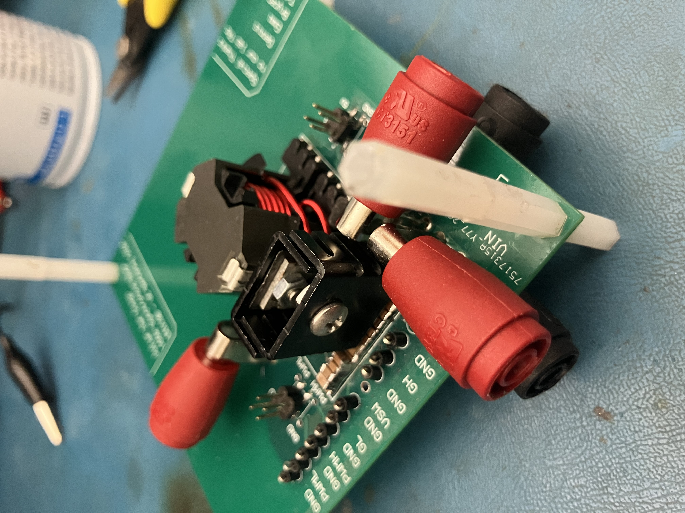
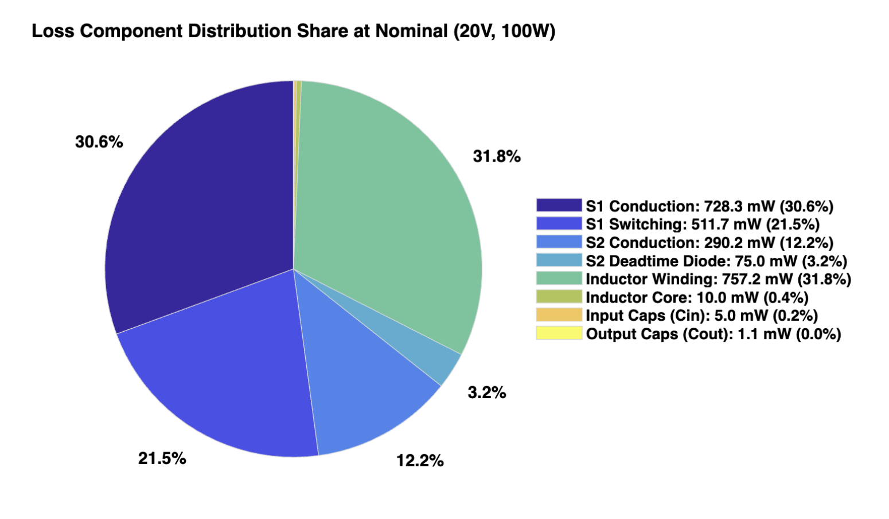
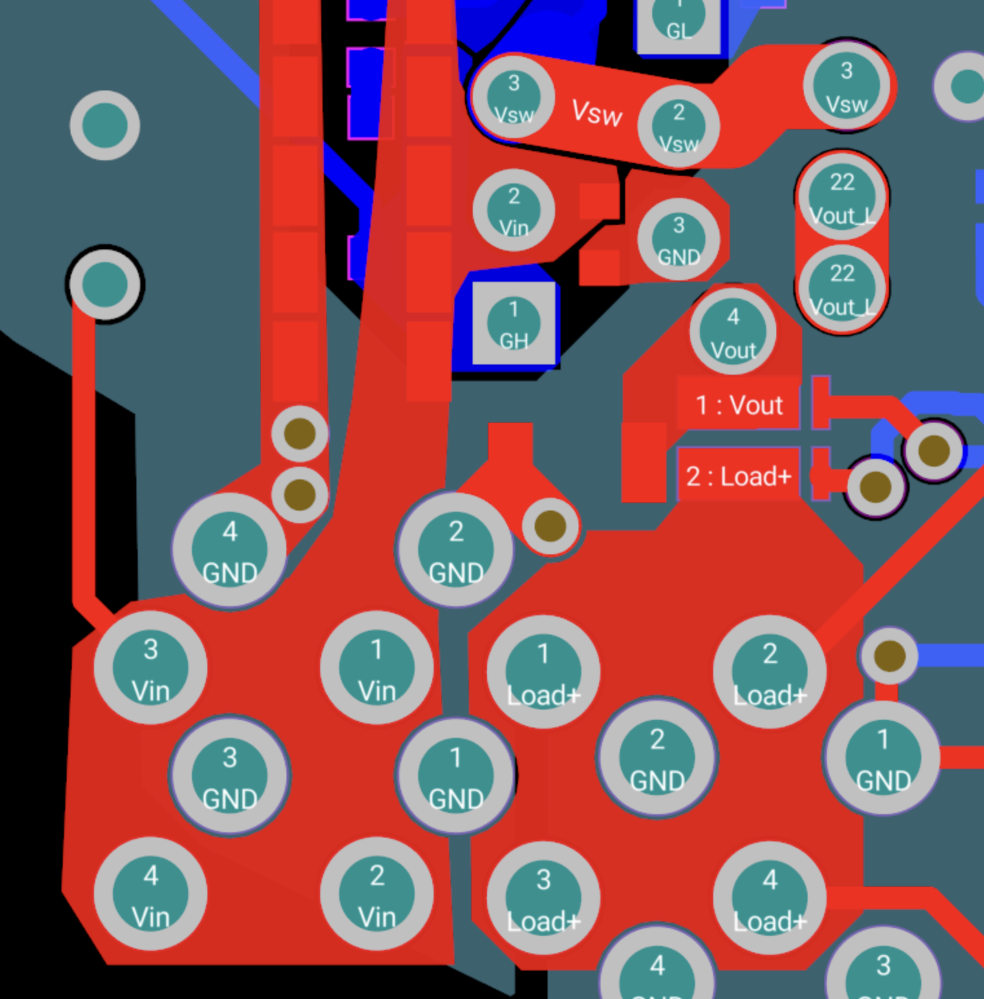
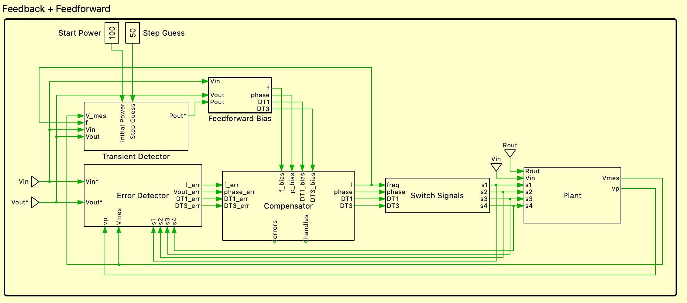
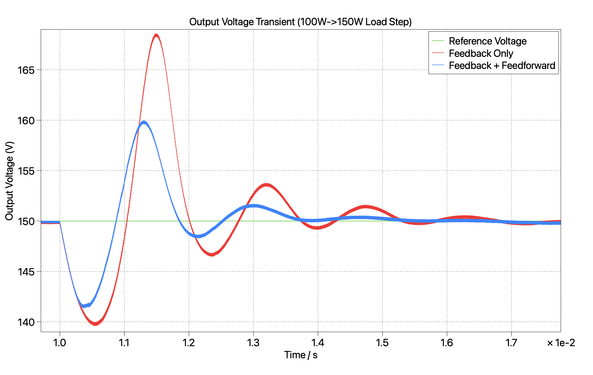
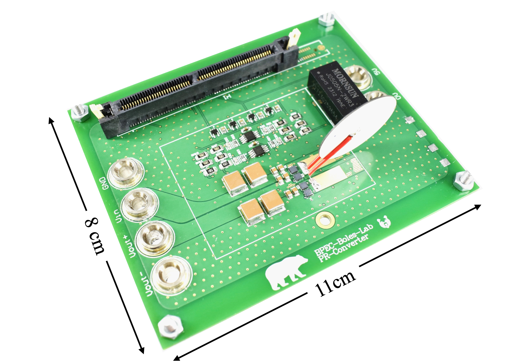

# JULIAN SAN DIEGO
**Electrical Engineering & Computer Sciences | University of California, Berkeley**   
julianwsd@gmail.com | [LinkedIn](https://www.linkedin.com/in/juliansandiego/) | [GitHub Pages](https://julianwsd.github.io/)

---

## 100W Synchronous Buck Converter with Digital Control

### Summary
Designed, routed, and validated a high-efficiency 100W synchronous buck converter (16V-24V Input, 12V Output) optimized for high power density and efficiency. The system utilizes a TI C2000 microcontroller to execute real-time digital control and a Perturb and Observe (P&O) MPPT firmware implementation.

* **Peak Experimental Efficiency:** 97.6%
* **Modeled Efficiency:** Within 1% of Experimental
* **Control Architecture:** Maximum Power Point Tracking / Duty Cycle Control via TI C2000
* **PCB Architecture:** 4-Layer board with tight commutation loops and dedicated internal ground return plane

---

### System Specifications & Design Intent
This synchronous buck converter interfaces a variable photovoltaic (PV) module with a 12V DC battery charging rail. The architecture optimizes power density and efficiency to enable passive thermal management while enforcing strict power quality and noise isolation boundaries:

* **PV Input Envelope:** 16V-24V DC nominal to accommodate solar irradiance and temperature swings.
* **Regulated DC Output:** 12V DC nominal charging bus supporting up to 8.33A continuous (100W max throughput).
* **MPPT Tracking:** Active C2000 firmware control continuously tracks the maximum power point to maximize harvesting efficiency during atmospheric transients.
* **Voltage Ripple Limits:** Bound to 5% of nominal averages to ensure feedback signal integrity and protect downstream battery chemistry.
* **Layout Constraints:** Compact component footprints and tight loop areas enforced to minimize EMI and safeguard sensitive digital telemetry from switching-node noise.

---

### Analytical Loss Modeling
To predict thermal performance and guide component selection, an iterative conduction and switching loss model was developed.

  
*Figure 2: Analytical loss distribution at nominal 100W output*

* **S1 Conduction:** 728.3 mW (30.6%)
* **S1 Switching:** 511.7 mW (21.5%)
* **S2 Conduction:** 290.2 mW (12.2%)
* **S2 Deadtime Diode:** 75.0 mW (3.2%)
* **Inductor Winding:** 757.2 mW (31.8%)
* **Inductor Core:** 10.0 mW (0.4%)
* **Input Caps ($C_{in}$):** 5.0 mW (0.2%)
* **Output Caps ($C_{out}$):** 1.1 mW (0.0%)

> **Key Takeaway:** The mathematical model predicted a nominal efficiency of **97.68%**, which closely aligned with experimental bench characterization within 1%.

---

### PCB Layout & Parasitic Mitigation
High-frequency switching nodes require strict loop area minimization to mitigate voltage overshoot and electromagnetic interference (EMI). The board was realized on a 4-layer stackup using Altium Designer.

  
*Figure 3: Top layer copper routing showing the minimized critical commutation loop*

* **Commutation Loop:** Placed high-frequency ceramic decoupling capacitors in ultra-close proximity to the MOSFETs via heavy top-layer copper pours. This tightly constricts the primary switching loop, providing the shortest path for high-frequency current commutation to suppress voltage spikes.
* **Power Return:** Dedicated an uninterrupted Ground plane to Layer 2 directly beneath the power paths. High-frequency return currents mirror the forward path perfectly, minimizing loop inductance while maximizing passive thermal dissipation.
* **Signal Isolation:** Structurally isolated sensitive analog feedback and digital C2000 control lines from noisy nodes. Restricting routing to quiet zones prevents switching noise from corrupting ADC windows, ensuring stable MPPT tracking.

---

### Digital Control Loop Implementation
Real-time output regulation is executed on the TI C2000 processing platform using a digital Perturb and Observe (P&O) control architecture optimized with a dynamic step-size algorithm. Telemetry data is captured via software-triggered Analog-to-Digital Converter (ADC) conversion windows to track real-time power shifts and modulate the gate drive outputs.

* **Dynamic Step-Size Regulation:** To balance transient convergence speed with steady-state stability, the tracking loop implements a variable step coefficient. When large power deltas are detected, the firmware applies a wider duty cycle adjustment to accelerate settling time; as the target 12V output is approached, the step size automatically decays to minimize steady-state voltage ripple.

---
---

## Undergraduate Research Project: Feedforward Control for Piezoelectric Based DC-DC Converter

### Executive Summary / Abstract
This technical brief presents a high-performance analytical feedforward control framework designed to supplement traditional closed-loop regulation for an 8-stage piezoelectric DC-DC converter. While legacy control methods for piezoelectric topologies rely strictly on feedback loops, implementing predictive feedforward control has historically been blocked by the complex transcendental equations required to model the converter's internal states. This approach unifies a sinusoidal approximation with a charge-weighted frequency approximation, bypassing these computational bottlenecks to calculate timing parameters in real time. The resulting dynamic feedforward law was validated in simulation, showcasing significantly enhanced transient response profiles during severe step-load variations compared to traditional feedback-only baselines. Experimental bench validation is underway to solidify transient performance characteristics in preparation for a showcase at APEC 2027.

---

### System Architecture & Theory
Closed-loop control of piezoelectric-based DC-DC converters is still in the early stages of development. Existing control strategies predominantly rely on multi-feedback loops or active current sensing. While these methods achieve steady-state regulation, they present severe engineering tradeoffs: multi-feedback architectures drastically increase loop complexity and tuning sensitivity, while high-frequency current sensing introduces prohibitive board space overhead, signal noise, and efficiency penalties due to sensing resistor losses.

This work aims to dramatically improve the transient response of existing closed-loop control methods by supplementing the baseline feedback loop with a dynamic feedforward bias that can be calculated in real time on a microcontroller.

  
*Figure 1: PLECS system architecture showing the analytical feedforward control block interacting with the feedback loops.*

---

### Simulation Results & Transient Performance
To evaluate the efficacy of the proposed feedforward framework, rigorous transient simulations were conducted against a legacy closed-loop baseline architecture. The system was subjected to aggressive step-load disturbances to benchmark settling time and voltage deviations.

  
*Figure 2: Transient simulation waveforms illustrating the output voltage recovery tracking of the proposed analytical feedforward control law versus the legacy baseline during a 50% step-load variation.*

---

### Hardware & Firmware Implementation
Hardware validation and active firmware development are executed utilizing a dedicated legacy piezoelectric hardware bench setup. The firmware realization leverages optimized execution blocks to map the calculated analytical timing parameters directly to high-resolution peripheral PWM modules on a TI C2000 microcontroller.

  
*Figure 3: Legacy Piezoelectric Resonator based power converter [Mustapha Touhami/BPEC]. This existing hardware platform serves as the experimental validation bench for the proposed real-time feedforward control law implementation.*